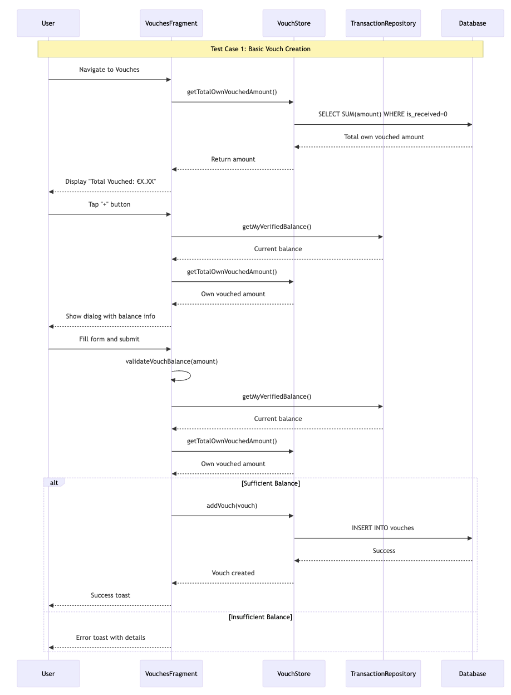
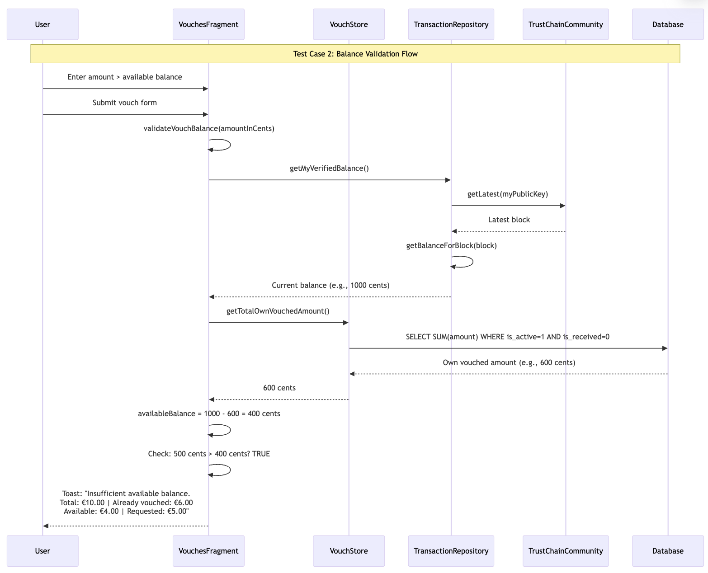
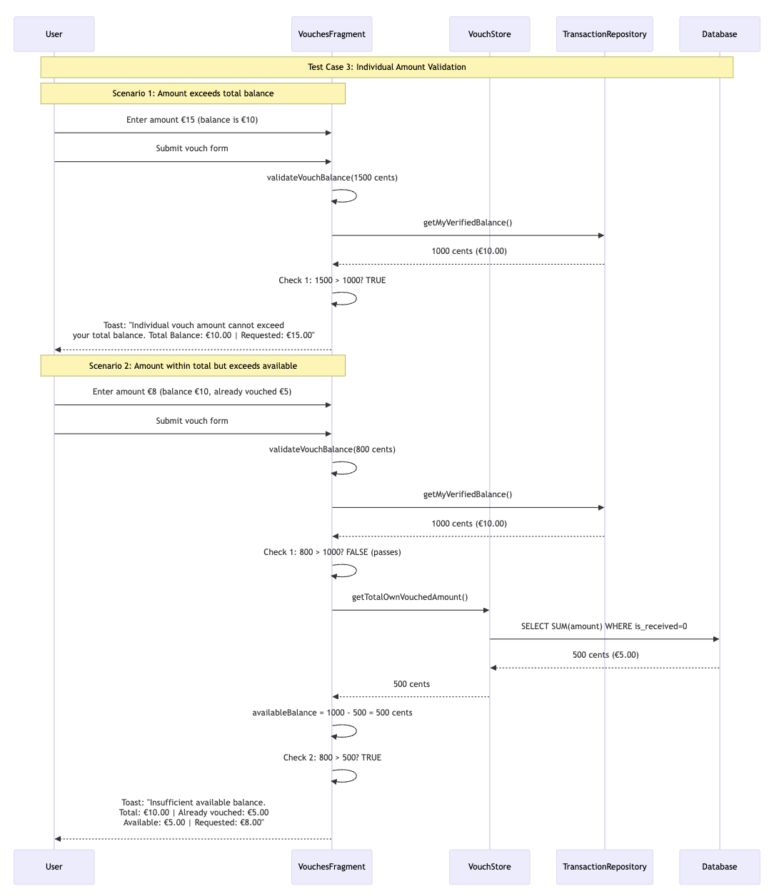
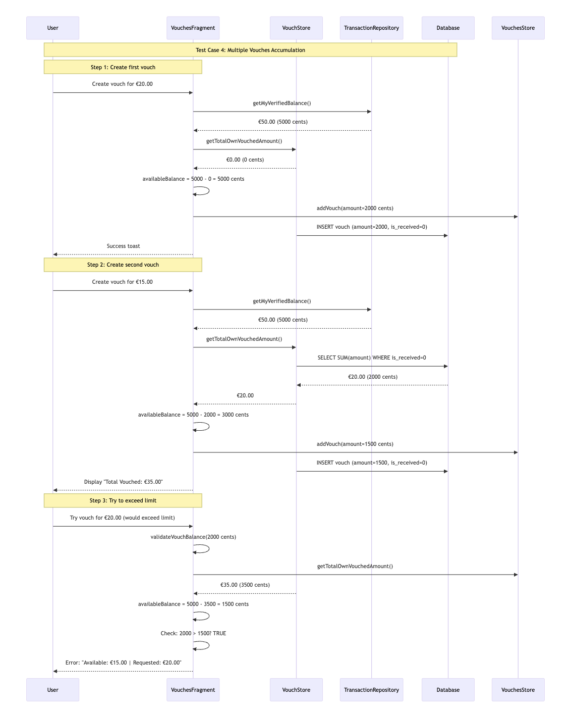

# Vouch Feature Implementation

## Overview

The vouch feature allows users to create commitments to pay certain amounts for other users until set expiry dates. This creates a trust-based system where users can vouch for others based on their available balance.

## Key Components

### Database Layer

**Files:**

- `eurotoken/src/main/sqldelight/nl/tudelft/peerchat/sqldelight/DbVouch.sq`
- `eurotoken/src/main/java/nl/tudelft/trustchain/eurotoken/db/VouchStore.kt`

**Database Schema:**

```sql
CREATE TABLE vouches (
    id INTEGER PRIMARY KEY AUTOINCREMENT,
    vouched_for_pub_key BLOB NOT NULL,
    amount INTEGER NOT NULL,
    expiry_date INTEGER NOT NULL,
    created_date INTEGER NOT NULL,
    description TEXT NOT NULL DEFAULT '',
    is_active INTEGER NOT NULL DEFAULT 1,
    is_received INTEGER NOT NULL DEFAULT 0,
    sender_pub_key BLOB
);
```

**Key Fields:**

- `is_received`: 0 = own vouch, 1 = received from others
- `amount`: stored in cents (multiply by 100 from euros)
- `is_active`: 1 = active, 0 = inactive/cancelled

### Data Model

**File:** `eurotoken/src/main/java/nl/tudelft/trustchain/eurotoken/entity/Vouch.kt`

```kotlin
data class Vouch(
    val vouchedForPubKey: ByteArray,
    val amount: Long, // in cents
    val expiryDate: Date,
    val createdDate: Date,
    val description: String = "",
    val isActive: Boolean = true,
    val isReceived: Boolean = false,
    val senderPubKey: ByteArray? = null
)
```

### UI Components

**Main Files:**

- `eurotoken/src/main/java/nl/tudelft/trustchain/eurotoken/ui/vouches/VouchesFragment.kt`
- `eurotoken/src/main/res/layout/fragment_vouches.xml`
- `eurotoken/src/main/res/layout/dialog_create_vouch.xml`

**Features:**

- Tabbed interface (My Vouches / Received Vouches)
- Create vouch dialog with balance validation
- Real-time balance display
- User selection from trust scores

## Balance Validation Logic

### Core Logic

```kotlin
private fun validateVouchBalance(amountInCents: Long): Boolean {
    val currentBalance = transactionRepository.getMyVerifiedBalance()
    val totalOwnVouchedAmount = vouchStore.getTotalOwnVouchedAmount()
    val availableBalance = currentBalance - totalOwnVouchedAmount

    // Check 1: Individual vouch amount cannot exceed total balance
    if (amountInCents > currentBalance) return false

    // Check 2: Available balance after considering existing vouches
    return amountInCents <= availableBalance
}
```

### Key Methods

1. **`getMyVerifiedBalance()`** - Gets verified balance from agreed blockchain transactions
2. **`getTotalOwnVouchedAmount()`** - Gets total amount user has vouched for others (excludes received vouches)

### Balance Calculation

```
Available Balance = Current Balance - Total Own Vouched Amount
```

## Detailed Testing Flow

### Prerequisites

1. Have the EuroToken app installed and running
2. Have some balance in your account (use demo mode or receive transfers)
3. Have completed transactions with other users to build trust scores
4. Access to at least one other user for testing

### Test Case 1: Basic Vouch Creation

**Objective:** Verify basic vouch functionality works correctly

1. **Navigate to Vouches**

   - Open EuroToken app
   - Go to menu → "Vouches"
   - Verify you see tabs: "My Vouches" and "Received Vouches"

2. **Check Initial State**

   - Note current balance displayed at top
   - Verify "My Vouches" tab shows existing vouches (if any)
   - Check "Total Vouched" amount

3. **Create a Valid Vouch**
   - Tap floating "+" button
   - Verify dialog shows current balance info: "Balance: €X.XX | Vouched: €Y.YY | Available: €Z.ZZ"
   - Select a user from dropdown (must have trust score)
   - Enter amount less than available balance (e.g., €5.00)
   - Select future expiry date
   - Add optional description
   - Tap "Create Vouch"
   - **Expected:** Success toast appears, dialog closes, vouch appears in "My Vouches" tab

### Test Case 2: Balance Validation

**Objective:** Verify balance checks prevent over-vouching

1. **Test Insufficient Balance**

   - Create new vouch with amount > available balance
   - **Expected:** Error toast with specific amounts: "Insufficient available balance. Total: €X.XX | Already vouched: €Y.YY | Available: €Z.ZZ | Requested: €W.WW"

2. **Test Edge Cases**
   - Try vouching for exactly your available balance (should work)
   - Try vouching for 0.01 more than available (should fail)
   - Try negative amounts (should be prevented by input validation)

### Test Case 3: Individual Amount Validation

**Objective:** Verify individual vouch amounts cannot exceed total balance

1. **Test Individual Amount Exceeds Balance**

   - Have €10 total balance with €0 already vouched
   - Try creating vouch for €15 (exceeds total balance)
   - **Expected:** Error toast: "Individual vouch amount cannot exceed your total balance. Total Balance: €10.00 | Requested: €15.00"

2. **Test Edge Case with Existing Vouches**

   - Have €10 total balance with €10 already vouched
   - Try creating vouch for €1 (exceeds total balance)
   - **Expected:** Same error about exceeding total balance (should fail before available balance check)

3. **Test Valid Individual Amount**
   - Have €10 total balance with €8 already vouched
   - Try creating vouch for €1.99 (less than both total balance and available balance)
   - **Expected:** Should succeed

### Test Case 4: Multiple Vouches Accumulation

**Objective:** Verify multiple vouches correctly reduce available balance

1. **Create First Vouch**

   - Create vouch for €5
   - Note remaining available balance

2. **Create Second Vouch**

   - Create another vouch for €2
   - **Expected:** Available balance should be reduced by €7 total
   - Verify "Total Vouched" displays correct sum

3. **Test Limit**
   - Try creating vouch for more than remaining available balance
   - **Expected:** Should fail with specific error message

## Sequence Diagrams

### Test Case 1: Basic Vouch Creation Flow



### Test Case 2: Balance Validation Flow



### Test Case 3: Individual Amount Validation Flow



### Test Case 4: Multiple Vouches Accumulation



## Implementation Details

### Vouch Creation Flow

1. User clicks "Add Vouch" button
2. Dialog shows current balance information
3. User selects recipient from trusted users
4. User enters amount and expiry date
5. **Balance validation** runs before creation
6. If valid, vouch is stored in database
7. UI refreshes to show updated totals

### Balance Validation Checks

1. **Negative Balance Check**: Prevents vouching if account balance is negative
2. **Individual Amount Check**: Ensures individual vouch amount doesn't exceed total balance
3. **Available Balance Check**: Ensures total vouches don't exceed available balance after considering existing vouches
4. **Verified Balance Validation**: Uses `getMyVerifiedBalance()` for reliable, agreed-upon transactions

### Error Handling

- Clear error messages with specific balance breakdown
- Input validation for amounts and dates
- Graceful handling of database errors

## Bug Fixes Implemented

### 1. Received Vouches Bug

**Problem:** App incorrectly included received vouches when calculating available balance.

**Solution:** Created `getTotalOwnVouchedAmount()` method that only considers user's own vouches (`is_received = 0`).

### 2. Individual Amount Validation

**Enhancement:** Added validation to ensure individual vouch amounts cannot exceed user's total balance.

**Implementation:** Added two-level validation system with clear error messages for different failure scenarios.

## Testing the Feature

### Test Scenarios

1. Create vouch with sufficient balance
2. Attempt to create vouch exceeding balance
3. Verify received vouches don't affect balance calculation
4. Check balance updates after recent transactions

### Manual Testing

1. Send/receive money to change balance
2. Create vouches and verify balance calculations
3. Test with expired vouches
4. Verify UI updates correctly

## Future Enhancements

- Vouch fulfillment mechanism
- Automated vouch expiry handling
- Vouch transfer between users
- Integration with smart contracts
- Vouch reputation scoring
