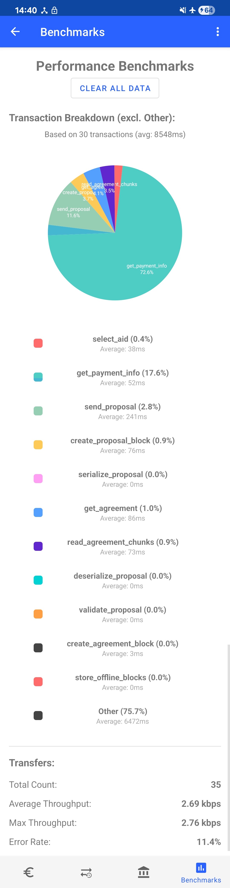

# Usage Logging for Transaction Benchmarks

## High-Level Overview

```text
┌───────────────────────────────────────────────────────────────┐
│                    UI Layer                                   │
│  ┌────────────────────┐  ┌──────────────┐  ┌───────────────┐  │
│  │ BenchmarksFragment │  │ PieChartView │  │ LegendAdapter │  │
│  └────────────────────┘  └──────────────┘  └───────────────┘  │
├───────────────────────────────────────────────────────────────┤
│                  Business Logic Layer                         │
│  ┌─────────────────┐  ┌─────────────────┐  ┌───────────────┐  │
│  │UsageBenchmark   │  │Transaction      │  │ Transaction   │  │
│  │Calculator       │  │Checkpoint       │  │ Breakdown     │  │
│  └─────────────────┘  └─────────────────┘  └───────────────┘  │
├───────────────────────────────────────────────────────────────┤
│                   Data Access Layer                           │
│  ┌─────────────────┐  ┌─────────────────┐                     │
│  │ UsageEventsDao  │  │ UsageLogger     │                     │
│  └─────────────────┘  └─────────────────┘                     │
├───────────────────────────────────────────────────────────────┤
│                  Persistence Layer                            │
│  ┌─────────────────┐  ┌─────────────────┐                     │
│  │ Room Database   │  │ Event Models    │                     │
│  └─────────────────┘  └─────────────────┘                     │
└───────────────────────────────────────────────────────────────┘
```

## Core components

### Room Database

**Purpose**: SQLite-based persistence layer for storing all benchmark events with efficient querying capabilities.

**Key Features**:

- Room ORM with type-safe database access
- Singleton pattern with application context to prevent memory leaks
- Version 3 schema with migration support for future updates
- Fallback to destructive migration for development flexibility

**Database Structure**:

- Separate tables for each event type (transaction_start_events, transfer_done_events, etc.)
- Auto-generated primary keys and indexed transaction/transfer IDs
- Timestamp fields for all events enabling time-series analysis
- Enum storage for categorized data (error types, cancel reasons, transfer directions)

### Data Models

**Purpose**: Room entity classes that define the structure of logged events for comprehensive transaction analysis.

**Transaction Events**:
Represents monetary transactions (e.g., sending 2 euros to someone). Lifecycle spans from clicking "Send" to payment confirmation.

- `TransactionStartEvent` - Marks transaction initiation with payload context
- `TransactionErrorEvent` - Records transaction failures with error details
- `TransactionCancelEvent` - Logs cancellations with reason categorization (TIMEOUT, MANUAL)
- `TransactionDoneEvent` - Confirms successful transaction completion

**Transaction Checkpoint Events**:
Represents granular phases within each transaction for detailed timing analysis. Each checkpoint has a descriptive label (e.g., `create_proposal_block`) to identify bottlenecks and optimize performance.

- `TransactionCheckpointStartEvent` - Phase initiation timestamp
- `TransactionCheckpointEndEvent` - Phase completion timestamp
- Utility classes in `TransactionCheckpoint.kt` for convenient usage with try-with-resources pattern

**Transfer Events**:
Represents individual NFC data transfer instances (transceive operations). Tracks payload sizes, timing, and success rates for throughput calculations.

- `TransferStartEvent` - Records transfer initiation with direction and payload size
- `TransferDoneEvent` - Logs successful completion with received data size
- `TransferErrorEvent` - Categorizes failures (TIMEOUT, DISCONNECTED, MALFORMED, IO_ERROR)
- `TransferCancelledEvent` - Records transfer cancellations

### UsageEventsDao

**Purpose**: Room Data Access Object providing type-safe database operations for all benchmark event types.

**Key Features**:

- Suspend functions for non-blocking coroutine-based database operations
- Comprehensive insert methods for all event types
- Optimized query methods for benchmark calculations and analytics
- Bulk operations for data management and clearing

**Query Categories**:

- **Individual Event Retrieval**: Get specific events by transaction/transfer ID
- **Aggregate Counting**: Count events for success/failure rate calculations
- **Relationship Queries**: Link transactions to their transfers and checkpoints
- **Cleanup Operations**: Clear all events or specific event types for testing

### UsageLogger

**Purpose**: Central singleton for collecting performance events throughout the application lifecycle.

**Key Features**:

- Thread-safe coroutine-based logging
- Transaction state management (prevents orphaned events)
- Hierarchical event structure (Transaction → Transfer → Checkpoint)
- Automatic transaction ID generation and tracking

**Usage Pattern**:

```kotlin
// Start transaction logging
val transactionId = UsageLogger.logTransactionStart(payload)

// Track specific phases with checkpoints
trackCheckpoint("creating connection") {
    // Connection establishment code
}

// Log transfer operations
val transferId = UsageLogger.logTransferStart(TransferDirection.OUTBOUND, payloadSize)
// ... transfer logic
UsageLogger.logTransferDone(receivedBytes)

// Complete transaction
UsageLogger.logTransactionDone()
```

### Usage Analytics

**Purpose**: Comprehensive system for computing benchmark results from event logs and displaying them through interactive visualizations.

**UsageBenchmarkCalculator**:
Core analytics engine that processes raw event data into meaningful metrics:

- **Transaction Performance**: Success rates, completion times, payload analysis
- **Transfer Analysis**: Throughput calculations (bytes/ms → kbps), error categorization
- **Checkpoint Breakdown**: Phase-level timing analysis with percentage allocation
- **Aggregation Methods**: Maximum, average, and rate calculations across all events

**TransactionBreakdown**:
Data classes and methods for preparing benchmark results for visualization:

- Individual transaction analysis with checkpoint timing details
- Average breakdown computation across multiple transactions
- Percentage calculation for pie chart representation
- Duration formatting and normalization for UI display

**UI Components**:

- `BenchmarksFragment`: Main dashboard with real-time metric loading
- `PieChartView`: Custom Android view for transaction phase visualization
- `LegendAdapter`: RecyclerView adapter for detailed metric display with color coding
- Error handling and empty state management for robust user experience

## Data Flow

### 1. Event Collection Flow

```text
User Action → UsageLogger → DAO → Room Database
     ↓
Transaction Start
     ↓
Checkpoint Tracking (multiple phases)
     ↓
Transfer Operations (optional, multiple)
     ↓
Transaction Completion/Error/Cancel
```

### 2. Analytics Flow

```text
Room Database → DAO Queries → UsageBenchmarkCalculator → Aggregated Results → UI Components
```

### 3. Visualization Flow

```text
BenchmarksFragment.loadBenchmarkData() 
    → UsageBenchmarkCalculator.calculateAverageTransactionBreakdown()
    → PieChartView.setData() + LegendAdapter.setItems()
    → User sees visual breakdown
```

## Integration Points

### 1. Application Initialization

In `EuroTokenMainActivity.onCreate()`:

```kotlin
UsageLogger.initialize(applicationContext)
usageAnalyticsDatabase = UsageAnalyticsDatabase.getInstance(applicationContext)
benchmarkCalculator = UsageBenchmarkCalculator(usageAnalyticsDatabase.usageEventsDao())
```

### 2. Transaction Integration

In `SendMoneyFragment` (example integration):

```kotlin
binding.btnSend.setOnClickListener {
    val transactionId = UsageLogger.logTransactionStart(jsonData)
    // Launch NFC activity
}
```

### 3. NFC/HCE Integration

In `HCEService` and NFC components:

```kotlin
// Transfer logging for data exchange
UsageLogger.logTransferStart(TransferDirection.OUTBOUND, data.size)
// ... NFC communication
UsageLogger.logTransferDone(receivedData?.size)
```

## Experiment Setup

### Realistic Usage Tests

**Test Environment Setup**:

- Live testing with 2 physical Android devices (Samsung Galaxy S22+ and Google Pixel 4a)
- Airplane mode enabled to eliminate network interference
- Controlled NFC positioning for consistent data collection

**Test Cases**:

1. **Stable Use Case** (15 repetitions)
   - Transaction amount: 0.2 euros
   - Receiving phone placed stable on table surface
   - Sending phone positioned on top until transaction completion
   - Measures baseline performance under optimal conditions

1. **Quick Tap Test** (10 repetitions)
   - Simulates realistic person-to-person usage scenarios
   - Both phones held in hands throughout transaction
   - Tests performance with natural hand movement and positioning variance

1. **Phone Moved Too Fast Test** (5 repetitions)
   - Same handheld setup as quick tap test
   - Phones deliberately swiped quickly during transaction
   - Evaluates error resilience and recovery under challenging conditions

### Data Transfer Limit Testing

**Stress Test Configuration**:

1. **Large Payload Test**
   - Single transaction with 1MB payload injection
   - Measures maximum throughput capabilities
   - Identifies system limitations and thermal constraints
   - Monitors transaction timeout behavior and device thermal response

## Results

### Realistic Usage Benchmarks

Below are the results of the benchmarks of the 1st and 2nd realistic usage experiments. All 30 transactions completed successfully, which means that they were able to recover from the data transfer errors.
Experiment 3 showed that moving the phone to fast before the transaction finishes crashes the app.

#### Figure 1: Benchmark results showing transaction performance metrics and phase breakdown visualization



### Data Transfer Limits

The 1MB payload stress test transaction halted after 2 minutes and 30 seconds due to thermal constraints, with both devices experiencing overheating issues, and the app crashing.

#### Video 1: Large payload transfer test showing the transfer getting stuck and crashing

<https://github.com/user-attachments/assets/be3d713c-f5d7-4775-beeb-99bec8359864>

## Future Work

**Performance Optimizations**:

Currently, all benchmark metrics are recomputed every time the benchmark screen is opened, which can become laggy with large datasets of transactions and transfers. A simple improvement would be to implement caching strategies at different checkpoints, computing only new logs since the last cache update.

**Proposed Improvements**:

- **Incremental Computation**: Cache benchmark results and update only with new events
- **Background Processing**: Pre-compute metrics during idle time for instant dashboard loading
- **Data Retention Policies**: Implement automatic cleanup of old benchmark data to maintain performance
- **Real-time Monitoring**: Live dashboard updates during active transactions
- **Export Functionality**: CSV/JSON export capabilities for external analysis tools
- **Historical Trends**: Time-series visualization showing performance evolution over time
- **Alerting System**: Automated notifications for performance degradation or error rate spikes
