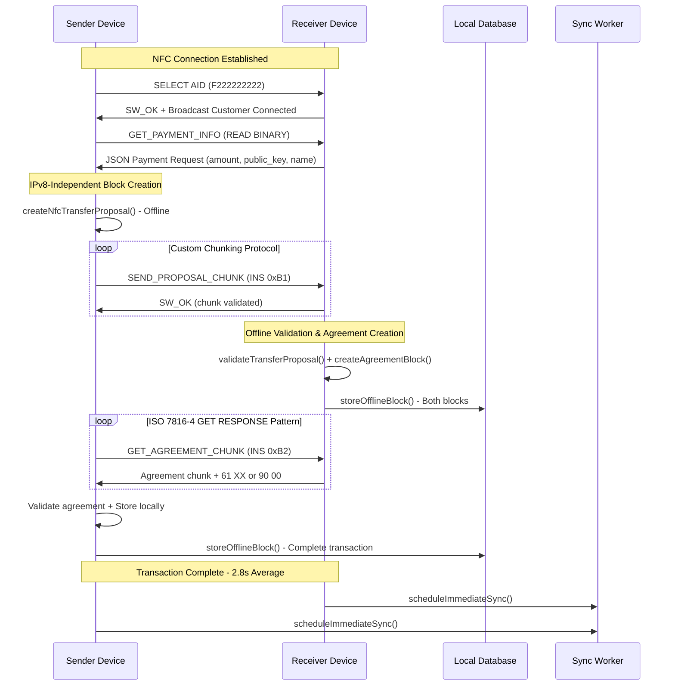

# Offline NFC Transfers for EuroToken

## High-Level Overview


## NFC Offline Transfer
https://drive.google.com/file/d/1CcauB_vsr80uB4u0jTdKbobTCCXSvXE5/view?usp=sharing

## NFC Eventual Block Synchronization
https://drive.google.com/file/d/1FB_oPv7ptMnyK5lK_DRL_F5_0A9Pk_qz/view?usp=sharing

## Design Decisions

### 1. **Host Card Emulation (HCE) Architecture**

- **Decision**: Implemented using Android's Host Card Emulation (HCE) service instead of physical NFC cards. Device A acts as HCE and device B as Reader Mode
- **Rationale**: Eliminates need for specialized hardware while maintaining security
- **Trade-offs**: Requires Android 4.4+ but provides universal device compatibility

### 2. **APDU Chunking Protocol**

- **Decision**: Custom chunking protocol for large transaction data over NFC
- **Rationale**: NFC ISO-DEP has ~255-byte ISO-DEP APDU limits, but Trustchain blocks can be several kilobytes
- **Implementation**:
    - Proposal Block Transfer
        - Custom Protocol with sender-initiated control
        - INS 0xB1 for chunk upload
        - 5-byte header prepended to each data chunk: [Flag:1][TotalChunks:2][ChunkIndex:2]
        - Intentional so the sender has full control over the transfer
    - Agreement Block Transfer
        - Intentionally not using our custom protocol, but ISO/IEC 7816-4
        - INS 0xB2: Initial Request
        - 61 xx: Status Word Chaing
        - INS 0xC0: Get Response
       

### 3. **Dual Transport Selection**

- **Decision**: Bottom sheet UI for choosing between QR and NFC transport
- **Rationale**: Maintains backward compatibility while introducing NFC as premium option
- **User Experience**: Clear visual distinction between transport methods

### 4. **Offline-First Design**

- **Decision**: Complete transaction processing without internet connectivity
- **Rationale**: Enables payments in areas with poor connectivity (rural areas, emergencies)
- **Sync Strategy**: Background sync via `SyncWorker` when connectivity returns

## System Architecture

### Core Components

#### 1. **EuroTokenHCEService** (Card Emulation)

**Purpose**: Acts as virtual payment terminal accepting transactions from sender devices.

**Key Features**:

- **AID Registration**: Custom Application Identifier `F222222222` for EuroToken recognition
- **APDU Command Handling**: Processes SELECT, GET_PAYMENT_INFO, SEND_PROPOSAL, GET_AGREEMENT commands
- **Terminal Mode**: Activated when device acts as payment receiver
- **Transaction Validation**: Cryptographic verification of payment proposals
- **Assymetric Chunking**: 

**Command Flow**:

1. `INS_SELECT (0xA4)` - Application selection with AID F222222222
2. `INS_GET_PAYMENT_INFO (0xB0)` - Payment request details transmission
3. `INS_SEND_PROPOSAL_CHUNK (0xB1)` - Chunked proposal block reception
4. `INS_GET_AGREEMENT_CHUNK (0xB2)` - Chunked agreement block transmission

#### 2. **NfcReaderActivity** (Reader Mode)

**Purpose**: Initiates and manages NFC communication as payment sender.

**Key Features**:

- **Reader Mode Configuration**: `FLAG_READER_NFC_A` 
- **Protocol Orchestration**: Manages complete payment flow from connection to completion
- **Error Handling**: Comprehensive error recovery with user-friendly messages
- **UI Feedback**: Real-time status updates with animated ripple effects

**Communication Sequence**:

```text
1. SELECT AID → Response with SW_OK + customer connection
2. GET PAYMENT_INFO → JSON payment request via READ BINARY
3. Create & validate proposal block (no IPv8)
4. SEND_PROPOSAL (chunked) → Validation on receiver
5. Receiver validation & agreement block creation
6. GET_AGREEMENT (chunked) → Agreement block retrieval + Validation
7. Transaction finalization -> local storage for both devices
8. Background sync scheduling (find peers) 
```

#### 3. **NfcChunkingProtocol**

**Purpose**: Handles fragmentation and reassembly of large transaction blocks.

**Protocol Specification**:

- **Chunk Size**: 240 bytes maximum (235 bytes data + 5 bytes header)
- **Header Format**: `[Flag][TotalChunks:2][ChunkIndex:2][Data:N]`
- **Flags**: `0x01` (first), `0x02` (last), `0x03` (single), `0x00` (middle)
- **Assembly**: `ChunkAssembler` class maintains state across chunk reception

#### 4. **TransportChoiceSheet**

**Purpose**: UI component for selecting transfer method (QR vs NFC).

**Features**:

- **Mode-Aware**: Different options for SEND vs RECEIVE operations
- **Amount Input**: Built-in dialog for receive amount specification
- **Navigation**: Seamless transition to appropriate transfer fragments

#### 4. **Sync Worker**

**Purpose**: Smart background synchronization

**Protocol Specification**:

- **State**: OfflineBlockSyncState tracks (Pending -> Syncing -> Synced)
- **Peer targeting**: Proposal blocks -> recipients, Agreement blocks -> proposers
- **Workmanager**: Background processing based on network connectivity
- **Adaptive**: Adjusts based on the availability of 'unsync blocks'


### Data Flow Architecture


## Implementation Details

### Key Code Changes from QR Implementation

#### 1. **Manifest Modifications**

```xml
<!-- NFC Permissions -->
<uses-permission android:name="android.permission.VIBRATE" />

<!-- HCE Service Registration -->
<service android:name=".nfc.EuroTokenHCEService"
    android:exported="true"
    android:permission="android.permission.BIND_NFC_SERVICE">
    <intent-filter>
        <action android:name="android.nfc.cardemulation.action.HOST_APDU_SERVICE" />
    </intent-filter>
    <meta-data android:name="android.nfc.cardemulation.host_apdu_service"
        android:resource="@xml/apduservice" />
</service>

<!-- NFC Reader Activity -->
<activity android:name=".ui.NfcReaderActivity"
    android:exported="true"
    android:screenOrientation="portrait">
</activity>
```

#### 2. **Transaction Repository Enhancements**

- **New Methods**: `validateTransferProposal()`, `createAgreementBlock()`, `storeOfflineBlock()`
- **Offline Block Management**: Local storage with sync capabilities
- **Serialization**: Block serialization/deserialization for NFC transmission

#### 3. **UI Architecture Changes**

- **SendMoneyFragment**: Added NFC payment mode with real-time status updates
- **RequestMoneyFragment**: HCE service integration with broadcast receivers
- **Transport Selection**: New bottom sheet for method selection

## User Flow Diagrams

### Sending Money via NFC


#### Video 1: User sending money through NFC

https://github.com/user-attachments/assets/70a008fc-2280-451c-ba32-b2053eba4c0c

### Receiving Money via NFC


#### Video 2: User receiving money through NFC

https://github.com/user-attachments/assets/e37e2699-ea6e-4729-a9cc-31155d325aea

## Error Handling

### NFC-Specific Errors

```kotlin
enum class NfcError {
    NFC_UNSUPPORTED,    // Device lacks NFC capability
    NFC_DISABLED,       // NFC turned off in settings
    TAG_LOST,           // Connection interrupted
    INSUFFICIENT_BALANCE, // Sender lacks funds
    PROPOSAL_REJECTED,   // Validation failed
    TIMEOUT,            // Communication timeout
    UNKNOWN_ERROR       // Unexpected failure
}
```

### Recovery Strategies

- **Automatic Retry**: For transient connection issues
- **Graceful Degradation**: Fallback to QR code if NFC fails
- **User Guidance**: Clear error messages with actionable steps

## Future Work

### Trust Information Exchange

Commented code exists for trust score propagation, but needs to be merged with the existing QR code based web of trust implementation.

## Dependencies and Requirements

### Android Requirements

- **Minimum SDK**: Android 4.4 (API 19) for HCE support
- **NFC Hardware**: Required on both sender and receiver devices
- **Permissions**: NFC and VIBRATE permissions

### External Dependencies

```gradle
implementation 'androidx.localbroadcastmanager:localbroadcastmanager:1.1.0'
implementation 'androidx.room:room-runtime:2.4.3'
implementation 'org.jetbrains.kotlinx:kotlinx-coroutines-android:1.6.4'
```
